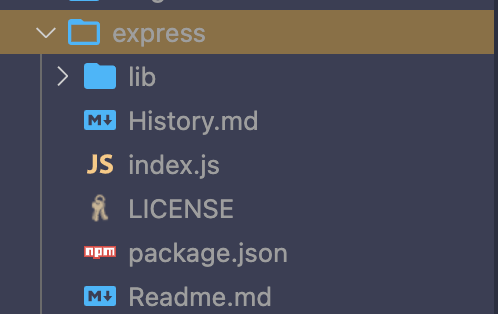
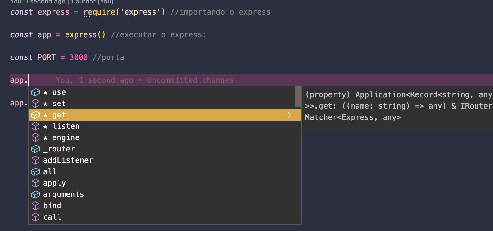
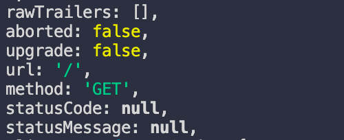

# Conteudo de aula

## Introdução (5min)
> - utilizar de analogia para as alunas entenderem como funciona o node.js

## Instalação e configuração do Node.js e npm (5min)

> - Instruir na instalação do nodejs
> - Verificar se a instação foi feita corretamente


## Criando um projeto do zero (20min)

> - Explicando como iniciar um projeto em nodejs utilizando npm.
> - Explicando o que é dependência, o que é express
> - Explicando a pasta `node_modules` e os arquivos`package.json` e `package-lock.json`

- Na pasta do projeto:

* **`npm init`** ou **`npm init -y`** ( com o `-y`atribui automaticamente valores padrão para todos os valores solicitados a inserir usando o npm init).
* Ao fazer isso será criado o `[package.json](<https://docs.npmjs.com/cli/v8/configuring-npm/package-json>)`

* Crie um arquivo `.js` (esse precisa ser do mesmo nome que tá em “main” no seu package.json)

```json
"main": "server.js",
```

- Instalação de dependências:


* Instale o express: **`npm install express --save`**([Express](https://expressjs.com/pt-br/).js para encaminhar cada solicitação [HTTP](https://github.com/reprograma/ON15-TET-S8-API-I/blob/main/material/API%20GET.pdf) para o manipulador adequado).

Chamar a atenção para  pasta node\_modules.

* A pasta `node_modules` contém todas as dependências instaladas para o seu projeto.

* Enquanto o arquivo `package.json` lista as dependências que nos informam as versões adequadas que devem ser instaladas para o projeto, o arquivo `package-lock.json`acompanha todas as alterações no `package.json`ou `node_modules` e nos informa a versão exata do pacote instalado.


| node_modules                            | package                        | package-lock  |
|-----------------------------------------|--------------------------------|----------------|
|  |   |   |


## Criando o servidor (30min)
> - explicar o que é servidor
> - O que é require
> - O que é módulo
> - HTTP
> - req e res
> - explicar a importância e o que é .gitIgnore


* Dentro do arquivo que você criou (server.js), importe o express.

* No node uma das maneiras de importar é com o **require**. Criando uma constante e atribuindo com o **require** passando a **módulo**.

`const express = require('express')`

* Agora precisamos criar outra const para executar o express:

`const app = express()`

* E uma const PORT, onde passaremos a porta

`const PORT: 3000`

* Se você digitar **app.** aparecerá algumas opções, selecione a opção **listen**


* O **app.listen()** escuta as requisições vindas da porta, passando o callback que sempre será executado ao receber uma requisição.

`app.listen(PORT, () => console.log(`Rodando na porta ${PORT}`))`

* Testando o servidor

No terminal, rode **node server.js**, provavelmente terá a saída: **Rodando na porta 3000**

* Localhost

Acessando no navegador locallhost:3000, você terá essa saída:


Não é nenhum erro, mas não temos nenhum verbo http(get/post/put/delete…) configurado.

Para exibir uma mensagem ao entramos em locallhost:3000, precisamos configurar o verbo **get**.

Digite novamente **app.** e selecione a opção **get**.



Com o get, mandamos uma request e o servidor precisa tá preparado para receber e responde-lo.

Como queremos que a nossa mensagem seja na pagina de inicio, logo quando o client digitar localhost:3000, então o caminho será **/**

**`app.get('/', function(req, res) {})`**

O **req** é o que estamos enviando, por exemplo se você colocar **console.log(req)** verá que ele envia várias coisas, uma delas é o caminho, **req.url,** a saída será **/** .



O **res** é a resposta do request.

Ao digitar **res.** aparecerá algumas opções, escolha o **send**. Veja que ao lado sempre mostra exemplos de como usar. O que vamos utilizar é o html, para mostrar uma \<h1> na pagina de incio.


```jsx
const express = require('express') //importando o express

const app = express() //executar o express:

const PORT = 3000 //porta

//criando rota get
app.get('/', function(req, res) {
    res.send('<h1>Bem-vindas!!!</h1>')
})

//iniciando o servidor
app.listen(PORT, () => console.log(`Rodando na porta ${PORT}`)) 
```

Pare o servidor (ctrl + c) e rode novamente: **node server.js**

Sempre que você alterar o arquivo server.js é necessário parar o servidor e rodar novamente.

Agora ao acessar[http://localhost:3000/](http://localhost:3000/) você verá a mensagem de **Bem-vindas!!!**


<!-- ## Nodemon

* Para não ficarmos toda hora parando o servidor e rodando novamente, vamos instalar o nodemon.

`npm install nodemon --save`

Para rodar o servidor com o nodemon: `nodemon server.js` Com isso nosso servidor será inicializado com o nodemon e você poderá editar seus arquivos sem precisar reiniciá-lo.

Ou podemos também configurar o **package.json** para não precisarmos digitar nodemon server.js.

No arquivo **package.json** em “scripts” add: `"start": "nodemon server.js"`


Agora para iniciar o servidor, digite: `npm start` -->

### .gitIgnore

O arquivo .gitIgnore usamos para ele ignorar alguns arquivos/pastas que não queremos subir ao fazer o commit. Por exemplo a pasta node\_modules.


<!-- 
## Estrutura de pastas

Criamos uma pasta src na raiz do nosso projeto, onde armazenaremos todos os códigos da aplicação. Dentro dessa, criaremos três pastas e um arquivo.

#### App.js

> Aqui no app que você vai usar a rota raiz

#### 📂 Routes

> Aqui nas rotas você vai usar os verbos para executar os controllers

#### 📂 Controller

> Aqui no controller você vai acessar os dados do seu model a partir das requisições e enviar respostas

#### 📂 Model

> Por enquanto estamos apenas guardando nosso JSON aqui, mas no futuro será o lugar onde você irá modelar os esquemas de dados para o banco. Não fique ansiosa! Acredite no processo, ele funciona! -->

## Encerramento (10)

- Explicar o que vimos passando por alguns pontos importante da estrutura do projeto.
